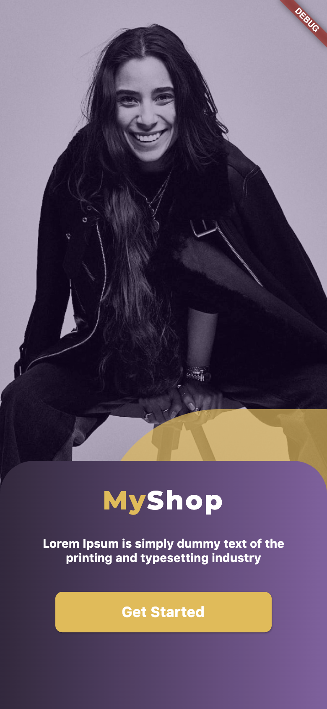
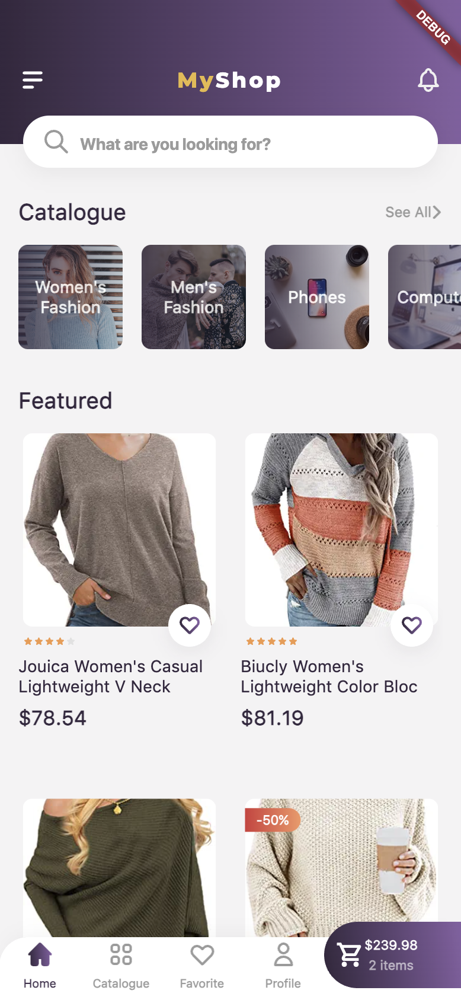
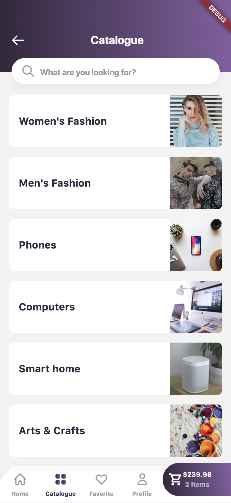
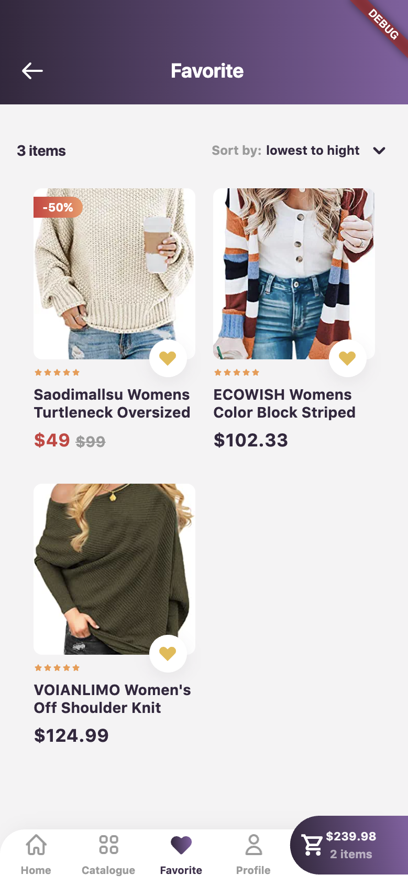
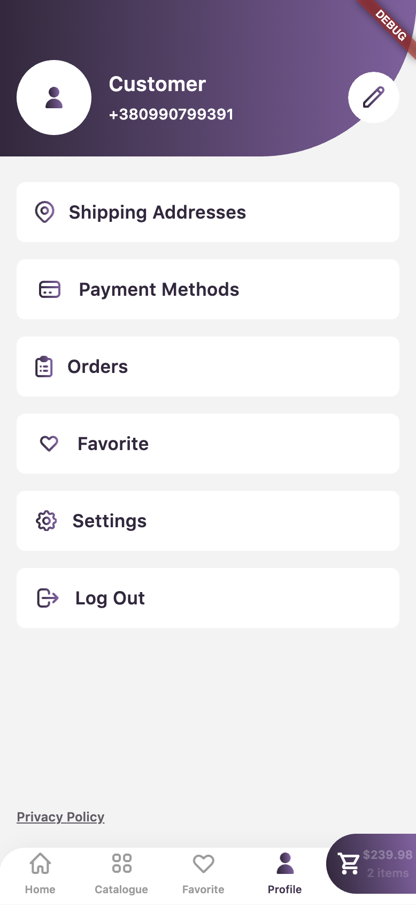

# MyShop FlutterFlow

The purpose of the project is to create an e-commerce application using FlutterFlow. The mobile app works both on
Android and iOS. The backend was built with Firebase.

Link to the project: https://app.flutterflow.io/project/my-shop-flutter-flow-c865qi

  
  
  

## Features

- Phone authentication
- Catalogue list
- Products feed with pagination
- Ability to add products to favorites
- User profile
- Cart
- Checkout

  
  
  
  
  
  

## Built with

- [FlutterFlow](https://flutterflow.io/) — no-code platform for building beautiful apps. Uses Flutter under the hood.
- [Firebase](https://firebase.google.com/) — backend as a service.

# License

This project is licensed under the GNU GPL v3 License - see the [LICENSE.md](LICENSE) file for details.
